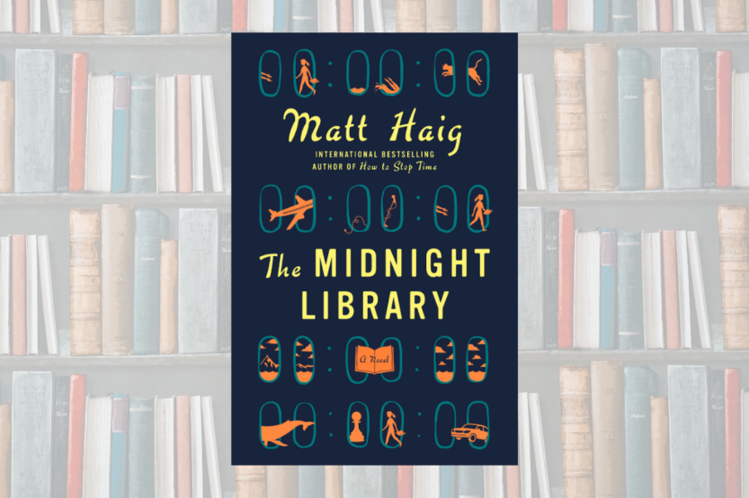

_Photo credits: https://penguinrandomhouselibrary.com/_

_"You don't have to understand life. You just have to live it."_

The Midnight Library by Matt Haig was the first book I read this year. I usually don't read fiction (unless it's science fiction) but I thought I'd give this book a try since it was voted the best book in the fiction category by Goodreads readers. This was also the first book by Matt Haig that I read. In short: I loved it. This is my spoiler-heavy review and thoughts on the book.

## What's it about?

The book is about a girl named Nora Seed, a philosophy graduate living in Bedford, England, who has decided to die. She recently broke up with her fiance because she got scared of committing, and has regretted the decision ever since. She backed out of a record label deal with her band that included her brother, and they still resent her for that decision. She wanted to become a glaciologist when she was a kid but instead, she ended up studying philosophy and now teaches piano more than she plays. She was a phenomenal swimmer who could've become an Olympic gold medalist if she had continued but she quit on that too shortly after school. She also backed out of plans to move to Australia with her best friend Izzie. Now they only communicate occasionally on social media, where she sends her pictures of humpback whales. She constantly lives in the state of "What would have been?" She works a dead-end job at "The String Theory" where she gives piano lessons. The only companion she has is her cat, Voltaire. In the first quarter of the book, we're given a background of her life and we can see that she's someone filled with regrets, considers herself a failure, works at a dead-end job, unloved, depressed, and having suicidal thoughts. I'm sure we can all relate to her at some level.

## Turning Point

The scales tip one day when she gets a knock on the door by a guy who had asked her out for a coffee date a year ago. He was a surgeon and a customer at The String Theory who Nora found attractive but she had declined because she was still engaged with her fiance.

> But she'd been feeling lonely. And though she'd studied enough existential philosophy to believe loneliness was a fundamental part of being a human in an essentially meaningless universe, it was good to see him.

She wonders if he's here to ask her out again but the tone in his voice and his countenance suggests something else. He informs that he found her cat lying dead in the middle of the road. Her only source of joy in her life had died due to her carelessness and being a terrible pet owner.

> As she stared at Voltaire's still and peaceful expression - that total absence of pain - there was an inescapable feeling brewing in the darkness. Envy.

To add salt to the wound, she gets fired from her job. She contemplates every decision she's ever made, all the regrets she has ever had. Her life was farthest from the one she had imagined it would be.

> There was an old musician's cliche, about how there were no wrong notes on a piano. But her life was a cacophony of nonsense.

## The Midnight Library

All this culminates in her deciding to end her life by taking a bunch of pills at midnight. This is when the story really begins. Instead of dying and ending up in heaven or drifting into nothingness (depending on who you ask), she wakes up in a library. The only difference is there are an infinite amount of books all moving constantly on the shelves, and the clock never moves past midnight. She meets the librarian from her childhood, Mrs. Elm, who had comforted her when her mother died back in middle school. She explains to her that the library exists between life and death and that each book represents a different path in her life, all the lives she could have lived, everything she could have been, a gateway into a life where she was successful, happy, rich or anything she ever wanted.

> "Oh, it is real, Nora Seed. But it is not quite reality as you understand it. For want of a better word, it is _in-between_. It is not life. It is not death. It is not the real world in a conventional sense. But nor is it a dream. It isn't one thing or another. It is, in short, the Midnight Library."

The first book Mrs. Elm hands Nora is The Book of Regrets, a thick book filled with every regret she has ever felt. The biggest regret she has is not marrying her fiance and not following his dream of starting a pub in the countryside. Elm explains to her that all of these books are lives that she could've lived and she could live them if she wanted. If at any time she felt complete disappointment with that life, she would be transported back to the library. She decides to live the life where she and her fiance are married and Mrs. Elm hands her the book in which they are married.

## The Married Life

Upon opening the book, she gets transported to the countryside outside of a pub named The Three Horseshoes. She quickly pieces together that it's the pub she and her fiance own. After a few puzzling chats with patrons heading home from the pub, she finally sees her husband. He seems different not just in his looks but also in his demeanor. She considers maybe it's just the drinks, or maybe it's the years of marriage that has changed him.

> A person was like a city. You couldn't let a few less desirable parts put you off the whole. There may be bits you don't like, a few dodgy side streets and suburbs, but the good stuff makes it worthwhile.

As the conversation goes on, she struggles to find any attraction to him that she used to feel in the past. She begins to realize all those times Dan had been hurtful to her in the past. He had completely ignored her dreams even though she accepted his dream and made it her own. He would mock her if she seemed to know more than him. All the red flags become apparent to her and as the conversation unfolds, she finds out that Dan had cheated on her twice after they got married. It was the final straw, and she speaks her mind to her husband feeling the full weight of disappointment and before she knows it, she is back in the library.

## No Nine Lives

With that experience, she no longer regrets not getting married to her fiance. The next life she wants to live is where her cat was still alive. She wakes up in her apartment and tries to call out for her cat to no avail. She looks under the bed and finds Volt's still body lying dead. The shock of it instantly sends her back to the library. She is furious and asks why Mrs. Elm gave her a book where her cat was still dead when she asked for one where he was still alive. Mrs. Elm explains to her that some things cannot be undone and that Volts had a health condition since birth and that it was a miracle that he lived so long. He didn't die as roadkill as she thought but instead passed away in the middle of the road peacefully due to his condition. She was not a terrible pet owner and she had given Volts a great life.

> "But I still don't get why you let me go into that life if you knew Volts was going to be dead anyway? You could have told me. You could have just told me I wasn't a bad cat owner. Why didn't you?"

> "Because, Nora, sometimes the only way to learn is to _live_."

With this revelation, we get the theme of the book and where it's trying to go. We operate with very limited information and our interpretation of our past is very flawed and the future is very uncertain and unclear. Our mind makes up scenarios that conform to our beliefs and experiences however removed from reality it might be.

## Australia

The next life she lives is one where she moved to Australia with her friend Izzie. To her confusion, she wasn't in Byron Bay where they had planned to move. She was instead in Sydney. She sees no indication of Izzie anywhere and going through her phone, finds her apartment. Her apartment is a mess with a stoned hippie roommate sitting on the sofa watching TV. She goes to the bathroom and finds a bunch of antidepressant pills and cut marks on her hands. Talking to her roommate, she finds out that Izzie died in a car accident while coming to visit her. The loss of a best friend is obviously enough to send her back to the library. Mrs. Elms remarks that "You can choose choices but not outcomes."

## Olympic Gold Medalist

The life where she continued swimming and became an Olympic gold medalist in the next life she chooses. In this life, she no longer swam competitively but wrote books and gave inspiring TED talks. Her brother was her manager of sorts, and she was in good relation with him but her dad had divorced her mom and married someone else. Her mom had died of alcoholism and she didn't have a good relationship with her. She had been in a 3-year relationship with another Olympic gold medal winner. She was still taking anti-depressant meds and she was set to give a speech to a crowd of thousands. Not knowing what to say in this life, she improvises.

> "And... and the thing is.. what we consider to be the most successful route for us to take, actually isn't. Because too often our view of success is about some external bullshit idea of achievement - an Olympic medal, the ideal husband, a good salary. And we have all these metrics that we try and reach. When really success isn't something you measure and life isn't a race you can win. It's all... bollock, actually..."

## I Want To Live

The story takes an interesting turn when she decides to live the life where she became a glaciologist researching Svalbard, Norway. She's in the middle of nowhere in freezing cold, and her research team has handed her a rifle to be on the lookout for polar bears. Soon enough, a bear comes rushing towards her but the rifle is not within reach and she feels fear of death. At this moment, she realizes she actually doesn't want to die. She wants to live with every fiber in her being. She summons all her strength and screams and manages to scare the bear away. Upon ruminating on this newfound desire to live, she comes to a profound realization.

> Maybe that's what all lives were, though. Maybe even the most seemingly perfect intense or worthwhile lives ultimately felt the same. Acres of disappointment and monotony and hurts and rivalries but with flashes of wonder and beauty.

Buddha realized some 2500 years ago that the only constant in life was suffering. Poor people suffer due to their poverty. Rich people, too, suffer because of their wealth. Of course, they're not the same but everyone suffers regardless. He came up with four noble truths to end human suffering. I'd love to talk more about Buddha and his philosophy but not here.

## Quantum Explanation

After barely surviving, one of the team members notices that Nora is different than she was yesterday and tells Nora that he is the same as her. He calls people who are living different lives "sliders" and mentions that he's already lived more than 1,500 alternate lives. Every possible life you could imagine but he still hasn't found a life where he wants to settle down. He also gives his theory of what's happening and this is where the story gets into the realm of science fiction. What all these lives are, he suggests, is the Many World Interpretation (MWI) theory of quantum mechanics. MWI holds that every possible outcome of a quantum experiment is realized in a different but parallel world. In terms of the story, every choice you've ever made results in a different reality where the choice was not made and vice versa.

## Rockstar

Later on, she lives the life where she continued her music career and became a rockstar. In that life, she had dated a movie star who she had a massive crush on. After a few events, she goes on to realize that being a rockstar isn't all glamorous. She slowly begins to realize that becoming a rockstar was her brother's dream, not hers and she only got into music so she would get the same attention her brother was getting from her parents. Later, she finds out that her brother was kicked from the band and had overdosed on pills, which sends her back to the library.

> And we spend so much time wishing our lives were different, comparing ourselves to other people and to other versions of ourselves, when really most lives contain degrees of good and degrees of bad.

## Someone Else's Dream

She goes on to live hundreds of lives. Every possible life she could imagine, she lives them but eventually always ends up in the library. When she starts to give up hope, Mrs. Elm reminds her that even bad experiences serve a purpose. She also realizes that every life she had tried had been someone else's dream. The pub was her fiance's dream, living in Australia was her best friend's dream, becoming a swimming champion was her dad's dream, and continuing with the band and becoming a rockstar was her brother's dream. Granted, being a glaciologist was her dream but it was mostly inspired by Mrs. Elm when her mother died.

> The regrets she had been living with most of her life were wasted ones.

> She realized that she hadn't tried to end her life because she was miserable, but because she had managed to convince herself that there was no way out of her misery.

## The Perfect Life

When she is on the verge of giving up, she decides to live the life where she said yes to the coffee date. In this life, she is already married to the guy and she has a daughter and a dog named Plato. She works at Cambridge as a lecturer but is taking a break from teaching to write her own book on Philosophy. Her husband is a wonderful man and she grows to love her daughter more and more. She starts to think that this might be the life she was looking for but lives with the worry that she might end up back in the library.

## I AM ALIVE

Soon enough, she does end up back in the library but the library is collapsing and all the books are beginning to burn. Mrs. Elm hands her a pen and points her to the only book that is not burning. The collapsing library represents her fading life in her original life. She struggles to make it to the book but with a newfound will to live, she makes it only to find that the book is empty.

> And she didn't want to live any other life than the one that was hers. The one that could be a messy struggle, but it was her messy struggle.

She uses the pen to write "I AM ALIVE" and wakes up in her apartment still woozy from all the pills she took. She gets taken to the hospital and barely survives. When she wakes up, she is looking forward to life.

## Final Thoughts

Even though this book was about a depressed girl who had nothing to live for, it was filled with a sense of hope. That's what I think the book is about. But it's more than that. I'm sure we're all guilty of daydreaming how our life would be different if we had just done that one thing differently or sometimes how we pine for a better life, a life that we imagined we would be living bereft of sadness or negative emotions. But how do we know if the life we daydream about is the life we would even enjoy or like. Like Buddha realized, life itself is a form of suffering sprinkled with a few moments of joy. It's a depressing thought but it can possibly make us appreciate those rare moments even more. We're born alone into this universe and our ultimate destiny is to die. In the grand scheme of things, nothing we do makes any difference at all. This is not a perfect book. I had issues with the story, particularly how Nora had to figure out who she was in a particular life. That got a little tedious but the ultimate lesson was well worth it. Matt Haig invites us to live life, _our life_, and not spend whatever limited time we have on Earth on "What ifs?". Personally, I would not trade my life for any other.

> "Well, that's the beauty, isn't it? You just never know how it ends."

> And Nora smiled as she stared at all the pieces she still had left in play, thinking about her next move.
