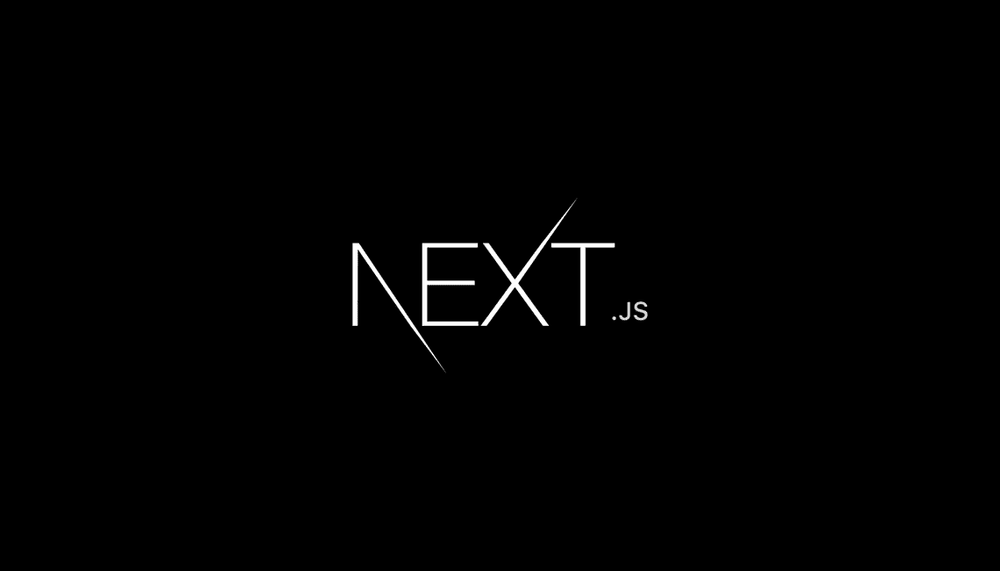

<!--  -->

My goal for 2021 is to complete a full-stack project by the end of the year. In order to achieve this goal, I need to learn a few back-end technologies. I will be writing about what I want to learn, why i want to learn it, and where or what resources I will be using to learn them. There are also three categories in my learning list: Definitely, Maybe (if i find the time for it), and In The Future (probably next year). The best way to learn is by doing. Keeping this in mind, I plan on doing a small project after learning each technology to really apply and solidify what I learn.

## Definitely

### TypeScript

JavaScript was built as a simple scripting tool back in the 90's by a developer working in Netscape. Today, JavaScript is being used to build the modern web, which it wasn't built for and might not be best suited either.

JavaScript, like Python, is a dynamically typed language meaning you don't have to define types when declaring a new variable. This is great for beginners, to prototype your software, and to bring it into production quicker. However, if the scale of the project gets larger, it quickly becomes a nightmare to debug. As most programmers would attest, it is better to find errors in compile-time than in runtime. Think about a statically typed language like C++. If you're writing faulty code, the compiler will scream at you and won't even compile until you fix the bugs. Whereas, JavaScript will happily compile and even run the program until you hit a bug when the program is live, which as you might have guessed can cause huge issues for a project or a company.

TypeScript, developed by Microsoft, adds a type system to JavaScript to avoid these problems and to make JavaScript more robust. It is a superset of JavaScript, meaning it compiles to JavaScript and you're not learning a new language but simply changing your `.js` extension into `.ts` extension and statically typing your code (which is entirely optional).

More and more companies are adopting TypeScript, and in the near future it will become expected of developers. As you can see below, TypeScript has the highest usage among developers surveyed by stateofjs.

It also has the highest satisfaction rate.

[TypeScript Deep Dive](https://basarat.gitbook.io/typescript/) book by [Basarat Ali Syed](https://github.com/basarat) is a great free resource that I will be using to practice TypeScript.

### Express

Express is a framework for Node.js and it is one of the most popular frameworks in JavaScript for back-end developers. Express seems to be the go-to framework for back-end, and since I have already learned Node.js, it seems like a no-brainer to expand my skills by learning Express.

I will be using [Rithmschool's](https://www.rithmschool.com/courses/node-express-fundamentals/introduction-to-express) course for Express.

### Next

Next.js is a React framework created by Vercel. I really enjoyed using Gatsby, especially how easy it was to set up a project and get going. Next is also optimized for production meaning you don't have to do many configurations to get your project up and running. They also have a great [tutorial](https://nextjs.org/learn/basics/create-nextjs-app) on their website, which I will be using to learn and practice.

### PostgreSql

PostgreSQL is a relational database based on SQL. Now my main goal with learning PostgreSQL is to brush up on my SQL and to learn a new database apart from mongodb. Recently, I've been watching a lot of videos by Ben Awad, and his recommendations for a tech stack are TypeScript, React, Nodejs and PostgreSQL. Luckily he has a tutorial for PostgreSQL on his youtube channel.

## Maybe

### React Spring

Typically, you create animations using CSS transitions, animation and keyframe rules. [React Spring](https://www.react-spring.io/) is a library that uses [spring physics](https://www.joshwcomeau.com/animation/a-friendly-introduction-to-spring-physics/) to create more organic and fluid animation. Every time I see a cool animation in a website, I am instantly hooked by it and I try to figure out how it was done. If I find the time to learn React Spring, I would like to add a few subtle animations to my website to make it more interactive.

### Redux

Redux is a state management tool that you can use with React or other frameworks such as Vue and Angular. Having to pass down a state down to a child component or lift the state to a parent component can be a bit of hassle and as your project becomes more complex with hundreds of components, each with their own states, managing states can easily be rage-inducing. That is where Redux comes in. Redux uses **reducers** that accept a state and an action, and returns a new state. Reducers are pure functions meaning they do not mutate variables outside it's scope. Although, I haven't felt the need to learn Redux because the things I'm working on are small personal projects, it can be a good tool to learn and have on your resume.

## In the future

- Docker
- Three.js
- Elixir
